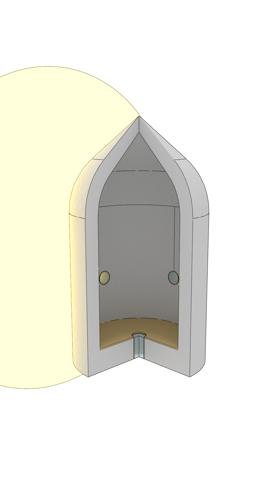
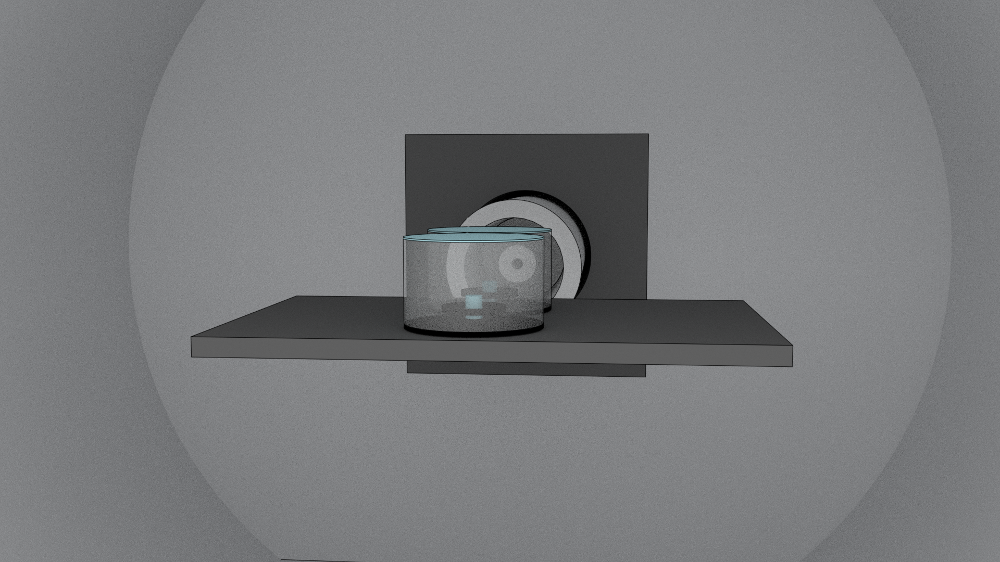

# wig

``wig`` has a couple parts.  Click the links below or just read through if
you're new here.

[MCNP Compilation Help](mcnp_compilation)

{height=320px}
{width=320px}
{width=320px}

MCNP (Monte Carlo N Particle) software, from LLNL, is an incredible tool for
simulation of neutrons, photons, and electrons.  I use it extensively for my
research, and it does a great job at a very complex task.  Unfortunately, it's a
nightmare to use.  Basically uncompilable by real humans, finicky about input
decks and spaces, and almost completely text only (even though Vis-Ed has gotten
steadily better), there are lots of improvements that could be made.

I'll be honest here, I'm writing ``wig`` to scratch my own itch. I need a way
to:

- create repeatable input decks
- automatically create publication worthy figures
- save geometry and materials as *assets* somewhere accessible and reusable
- add some sort of semantic meaning to the syntax of mcnp
- cite sources in input decks to remember where I got numbers and materials
- enable easy sending of input decks to be run on "clusters" through `ssh`

The name is a nod to Eugene Wigner, particularly his contributions to nuclear
structure and quantum mechanics, where he **made use of the random matrix** to
describe cross-section structure.  MCNP makes use of random numbers to help us
experimenters know what's physically going on, and I want `wig` to make use of
the "random" syntax of MCNP for ease of use.  So it's pronounced *vig*.

As of now, this package is in a really-really-really alpha stage.  I think only
I can use it because of it's finickiness.  But, it allows for quick (and
semantic) development of MCNP decks using a **pipeline** method.  The
**pipeline** method will be familiar to those that use MCNP a lot.  The steps in
the pipeline are:

1. Geometry (create `geo`s)
2. Materials (create `matl`s)
3. Cells (combine ``geo``s as needed and apply `matl`s)
4. Physics (there's a pretty hands off way to define the common physics)
5. Sources (create `source`)
6. Tallies (there's pretty hands off way for some tally specs now)
7. Run

The pipeline method means that this package is very semantic, so instead of just
typing in numbers separated by spaces, you actually assign variables and
document things.  You can also script MCNP because of python, for example if you
wanted to move a source throughout a bunch of different simulations for time
dependence.  Finally, this code will, if you have the proper requirements,
render pretty pictures of your simulation.
